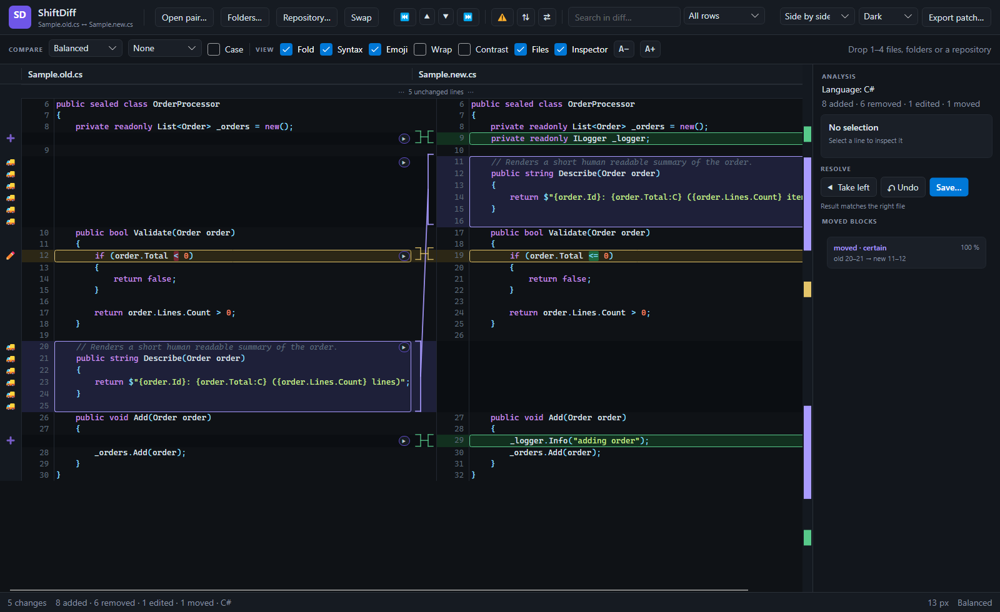
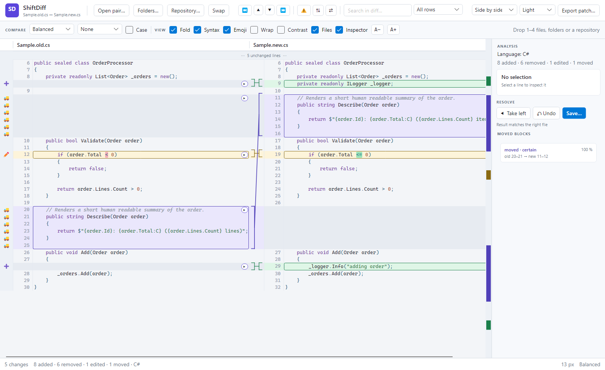

# ShiftDiff

[](https://github.com/Hawkynt/ShiftDiff/blob/main/LICENSE)
[](https://github.com/Hawkynt/ShiftDiff)

[](https://github.com/Hawkynt/ShiftDiff/actions/workflows/ci.yml)


[](https://github.com/Hawkynt/ShiftDiff/stargazers)
[](https://github.com/Hawkynt/ShiftDiff/network/members)
[](https://github.com/Hawkynt/ShiftDiff/issues)


[](https://github.com/Hawkynt/ShiftDiff/releases/latest)
[](https://github.com/Hawkynt/ShiftDiff/releases)
[](https://github.com/Hawkynt/ShiftDiff/releases)

> Semantic diff viewer for moved, edited, merged, and reconstructed content.

Traditional diff tools are line-oriented: a block of code that moved shows up
as a delete at the old spot and an add at the new one, and a large refactor
becomes an unreadable wall of red and green. ShiftDiff instead treats a diff as
a *relationship* problem — it tries to answer "where did this block go, and
what happened to it on the way" instead of just "what lines differ."

Full spec (goals, use cases, UI, roadmap): [SPEC.md](SPEC.md).

## Desktop application

A method was moved and its condition edited. Each change block is outlined in
its own colour, the gutter between the panes brackets each block on both sides
and joins them with a connector line, and an arrow on the block transfers it
into the reconstructed result in one click. Both ends of the move are drawn as one
relocated block, the moved-block list names it with a confidence and a
similarity score, and the overview bar compresses the whole file into stripes.

### Dark theme

[](docs/screenshots/workspace-dark.png)

### Light theme

[](docs/screenshots/workspace-light.png)

Details of the workspace, navigation and merge model:
[comparison workspace](docs/comparison-workspace.md). The deterministic showcase
inputs live in [`docs/showcase`](docs/showcase), and
[`scripts/capture-showcase.sh`](scripts/capture-showcase.sh) recaptures the real
window through the UI Showcase workflow.

## Command line

The same analysis drives the CLI. The default output names the moved blocks and
shows token-level edits inline, instead of rendering a move as delete + add:

```
$ shiftdiff compare old.cs new.cs --mode aggressive
--- old.cs
+++ new.cs
# C# · 6 added · 5 removed · 1 edited · 1 moved block(s)
M moved: old 17-20 -> new 7-10 (certain, 96 %)
@@ -4,9 +4,15 @@
     4    4
     5    5 public class Sample
     6    6 {
M         7     // Describes the sample
M         8     public string Describe()
M         9     {
M        10         return "sample";
+        11     }
+        12
     7   13     public bool Validate(int value)
     8   14     {
~    9   15         if (value [-<-]{+<=+} 0)
    10   16         {
    11   17             return false;
    12   18         }
```

```
shiftdiff compare <old> <new>                       two files or two folders
shiftdiff compare3 <base> <local> <remote>          three-way merge preview
shiftdiff compare4 <base> <local> <remote> <target> validate a reconstruction
shiftdiff apply-patch <source> <patch> --out <file> reconstruct a target
shiftdiff export-patch <old> <new> --out <patch>    write a unified/SVN patch
shiftdiff git status|diff|log [rev [rev]]           compare against Git
shiftdiff svn status|diff|log [rev [rev]]           compare against SVN
```

Options: `--format semantic|unified|git|svn|json`, `--json`, `--mode
strict|balanced|aggressive`, `--patch-mode exact|fuzzy|semantic`,
`--ignore-case`, `--ignore-whitespace`, `--context <n>`, `--emoji`/`--no-emoji`,
`--out <file>`, `--force`. `--format git` writes a real git patch (`diff --git`
headers, new/deleted file modes), `--format svn` an SVN-compatible one.

Exit codes: `0` no differences, `1` differences, `2` conflicts, `3` invalid
input, `4` internal error.

## How it works

The diff engine (`ShiftDiff.Core`) runs a normalize → hash → anchor → block →
score → classify pipeline:

1. **Line hashing** (`LineHasher`) — every line gets four hashes: raw,
   trimmed, whitespace-normalized, and whitespace-stripped ("token-normalized").
   This lets later stages match lines despite reformatting.
2. **Anchor detection** (`AnchorDetector`) — lines are graded by how
   trustworthy they are as a matching anchor (uniqueness, frequency, length),
   so low-value lines like `{`, `}`, blank lines, or repeated boilerplate
   can't single-handedly create a false match.
3. **Block building** (`BlockBuilder`) — contiguous runs of matching lines
   between the old and new file become candidate blocks.
4. **Similarity scoring** (`BlockSimilarityScorer`) — each candidate gets a
   combined score from eight independent signals: exact/normalized hash
   overlap, token-shingle Jaccard similarity, SimHash fingerprint similarity,
   block size ratio, ordering consistency, rarity-weighted anchor score, and
   neighboring-block consistency.
5. **Classification** (`BlockClassifier`) — each candidate becomes one
   `ChangeType`: `Unchanged`, `Edited`, `Added`, `Removed`, `Moved`,
   `MovedEdited`, `Split`, `Merged`, or `Uncertain` (via `SplitMergeDetector`
   for the split/merge cases), each carrying a `Confidence`
   (`Certain`/`Likely`/`Possible`/`Weak`/`Rejected`, from `ConfidenceClassifier`).
6. **Detection mode** (`DetectionMode`: `Strict`/`Balanced`/`Aggressive`) tunes
   the thresholds — minimum block size, minimum token count, maximum
   duplicate-anchor frequency, and the score cutoff between a pure move and a
   moved+edited block.

## Patch engine

`UnifiedDiffParser` / `UnifiedDiffFormatter` / `PatchApplier` round-trip
unified diffs, including Git's extended headers (mode changes, renames,
copies, similarity index, `diff --git` paths) and SVN-style diff export:

- **Parse** a unified/Git/SVN patch into structured hunks and file metadata.
- **Apply** a patch in exact mode (context must match verbatim), fuzzy mode
  (search nearby for a matching position when the recorded line offset is
  stale), or semantic mode (match by block identity instead of line number).
- **Export** the (possibly reconstructed) result back to a unified diff,
  a Git-compatible patch, or an SVN-compatible diff.

## Version control

`ShiftDiff.Vcs` puts Git and SVN behind one provider abstraction: repository
detection, working-tree/working-copy status, changes between revisions, file
content at a revision, and history. Every command runs through an injectable
process runner, so the providers are tested without a repository on disk.
Renames and copies Git reports are carried through as moves rather than as a
delete/add pair.

## Status

The diff/patch **engine** (`ShiftDiff.Core`) implements the pipeline above —
line hashing, anchor detection, block building/scoring/classification, split and
merge detection, move refinement, folder comparison with move/copy/rename
detection, multi-source workspace alignment, and unified/Git/SVN patch parsing +
exact/fuzzy/semantic application + export.

The **CLI** (`ShiftDiff.Cli`) runs the full spec command surface with the spec's
exit codes, a semantic default rendering, JSON output for automation, folder
comparison, and Git/SVN repository comparison.

The **presentation layer** (`ShiftDiff.Ui`) owns the document model, navigation,
filtering, the inspector and the interactive merge target, with no UI-framework
dependency, so it is unit-tested directly.

The **desktop UI** (`ShiftDiff.App`) is an Avalonia shell over that layer:
synchronized panes for two to four sources, intra-line token colouring, syntax
highlighting, folded unchanged regions, an overview bar, a file-list sidebar,
a change inspector, moved-block navigation, search and change-type filters,
block-level merging with undo and guarded export, revision-range comparison for
an open repository, word wrap, text zoom, a high-contrast mode, and
light/dark/system themes with switchable emoji markers.

**Not built yet:** staging and unstaging hunks, an SVN revision browser, a fully
editable character-level merge target, and AST-assisted matching. See SPEC.md
§17 for MVP scope and §18 for the planned versions.

## Layout

- `src/ShiftDiff.Core` — diff engine (hashing, anchor detection, block matching,
  folder and workspace comparison, patch parsing/application). No UI or VCS
  dependencies.
- `src/ShiftDiff.Vcs` — Git and SVN providers behind `IVcsProvider`.
- `src/ShiftDiff.Ui` — presentation layer: document model, settings, navigation,
  filtering, inspector, interactive merge. No UI framework dependency.
- `src/ShiftDiff.Cli` — command-line entry point.
- `src/ShiftDiff.App` — Avalonia desktop shell.
- `tests/…` — xunit tests per project, including headless Avalonia tests for the
  window.

Language profiles live in `ShiftDiff.Core` and are independent of the Avalonia UI.
See [source language support](docs/source-language-support.md) for the extension model.

## Building

```
dotnet build
dotnet test
dotnet run --project src/ShiftDiff.App -- path-a path-b [path-c] [path-d]
dotnet run --project src/ShiftDiff.Cli -- compare old.cs new.cs
```

## Workflow

TDD/BDD/DDD/SDD: every feature starts from a spec requirement (FR-xxx/AC-xxx
in SPEC.md), gets a failing test named after the behavior it pins, then the
implementation that turns it green. Domain terms in code match the spec's
vocabulary (block, anchor, hunk, confidence, role, etc.).

## ❤️ Support

If this project saves you time or money, consider supporting its development:

[](https://github.com/sponsors/Hawkynt)
[](https://www.paypal.me/hawkynt)

## License

Licensed under LGPL-3.0-or-later — see [LICENSE](LICENSE).
